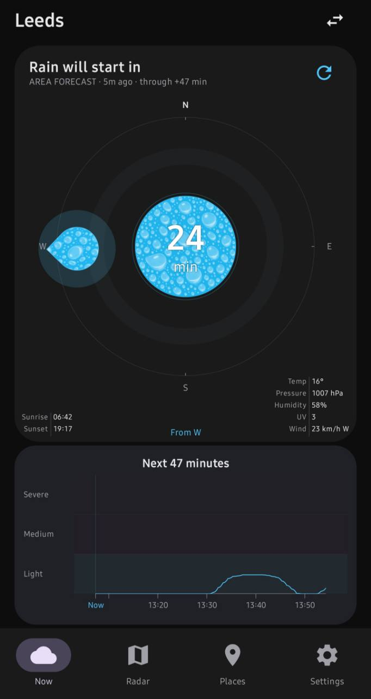
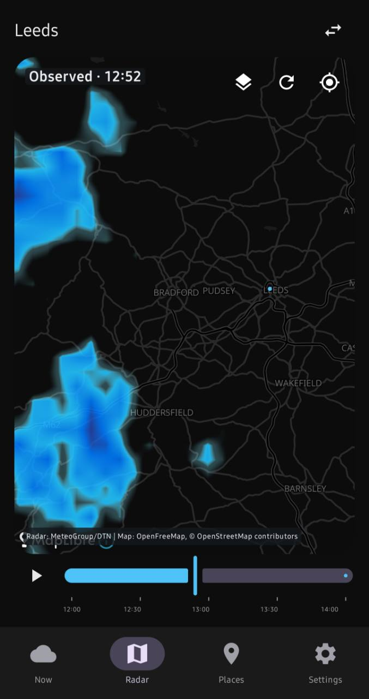
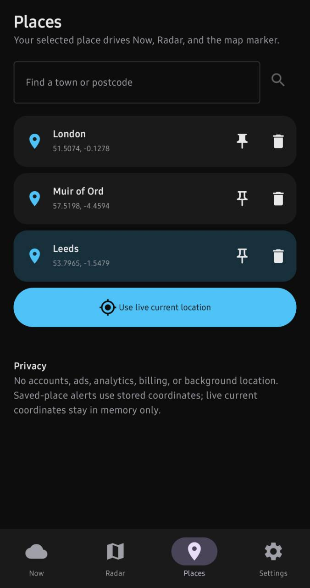
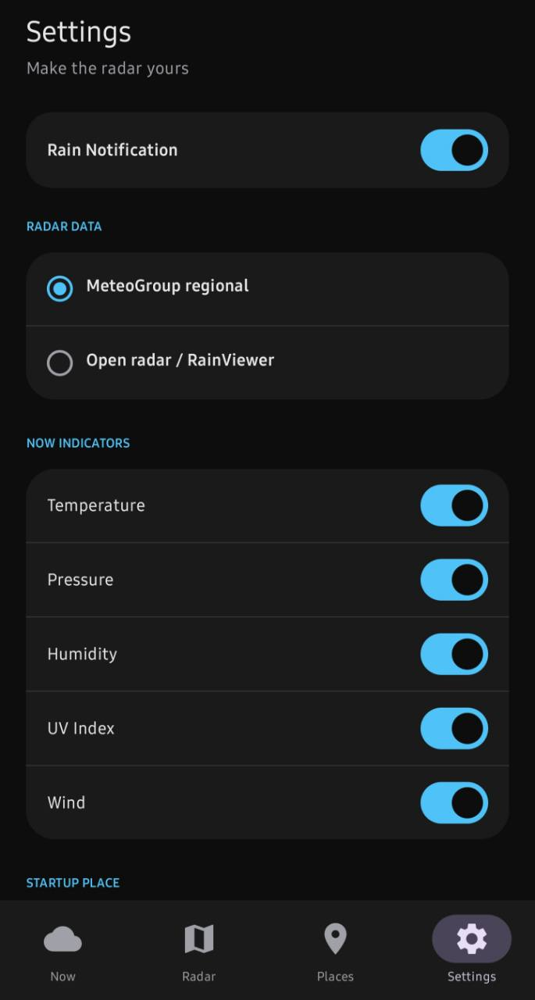
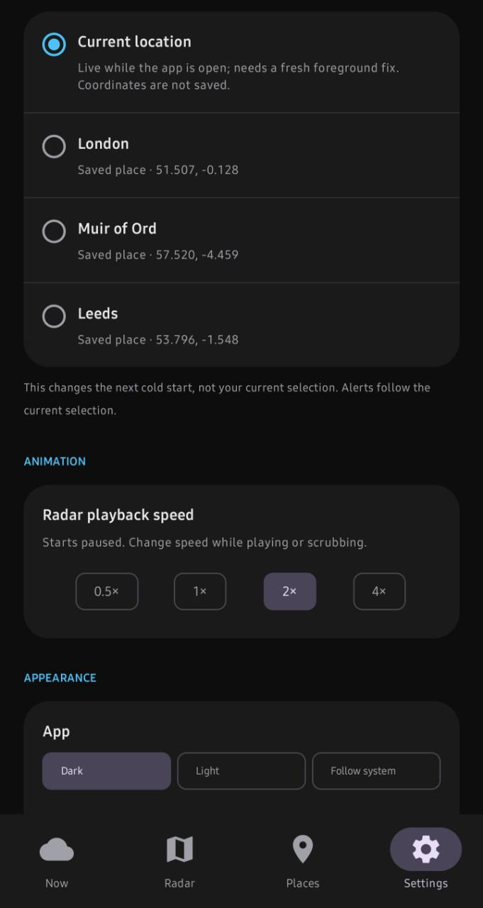

# Rain Alarm

## About

Rain Alarm 0.1.2 is a clean-room, open-source Android app for a simple question: **when will rain reach my selected place?** Now shows a place-specific rain outlook; Radar lets you inspect the source imagery and its available time window. The app does not contain the retired RainToday app, its native library, artwork, credentials or assets. Research material under `Research/RainToday` is development-only and is never packaged.

Download the [v0.1.2 signed release](https://github.com/Undert0e-505/RainAlarm/releases/tag/v0.1.2) and read its [release notes](docs/releases/v0.1.2.md) before installing. Earlier [v0.1.1 patch notes](docs/releases/v0.1.1.md) and [v0.1.0 release notes](RELEASE_NOTES.md) remain available. Rain Alarm is an experimental weather aid, not a safety-critical warning service.

The launcher artwork is the project owner's supplied Android icon pack, included as density-specific legacy and adaptive PNG resources under the project's MIT license. The supplied Play Store image is in `artwork/play_store_icon_512.png`. Notifications use a separate white-on-transparent droplet/bell small icon, not the launcher background.

## Screenshots

Tap a preview for the full-size image.

| Now · Leeds | Radar · Leeds |
| :---: | :---: |
| [](docs/screenshots/now-leeds.jpg) | [](docs/screenshots/radar-leeds.jpg) |
| Places | Settings · notifications and indicators |
| [](docs/screenshots/places.jpg) | [](docs/screenshots/settings-notifications-providers-indicators.jpg) |
| Settings · startup and appearance | |
| [](docs/screenshots/settings-startup-playback-appearance.jpg) | |

## First launch and defaults

A fresh install selects **Current location** as both the active and startup place. It requests foreground location permission once; until a fresh fix exists, Now/Radar say location is unavailable rather than using placeholder coordinates or silently forecasting for London. On Android 13+, a notification-permission request follows the location request if needed. Declining either request does not trigger repeated dialogs; Current can be retried from the place switcher and notifications from Settings. Previously stored places and explicit settings are preserved on upgrade.

The unset defaults are Rain Notification **on when permission allows**, all five Now weather indicators visible, radar playback **2×**, MeteoGroup regional radar, and dark app/dark map. Radar playback still starts **paused**. Settings can change the radar source, speed, app/map appearance, independent Compass-card and Graph-card appearance (each follows the app by default), visible weather indicators, alert toggle and default startup place. The Radar Layers dropdown remembers its own Off/Wind/Lightning/Fog choice; Off loads no ancillary layer.

## Features

### Now

- The selected place is prominent above a compact, non-scrolling compass/status card. The card shows rain status or ETA, provider/source age and forecast coverage. A place switcher offers saved places and virtual Current location; refresh shows progress and an updated/error result while retaining a valid same-place forecast when possible.
- The compass keeps geographic North up. Its incoming-rain indicator is one outlined circular droplet path with a 90° outward tip, a translucent halo, the same translucent raindrop texture as the centre disc, and a direction such as “From NW” when the source supplies a usable bearing. The centre shows **Now**, minutes until arrival plus “min”, or fresh model temperature when no incoming rain is predicted. If direction is unavailable, it is not invented.
- The centre disc uses the same intensity colour as a visible rain pointer. When rain is happening or approaching, a translucent raindrop texture converted from user-supplied artwork sits over that colour; the original black backdrop was removed so the intensity colour shows through. Dry/no-rain temperature keeps a plain branded-blue disc. Centre text is opaque white with a subtle dark edge for contrast on pale rain colours. Its settled disc is deliberately compact (25% smaller than the preceding design), while the ordinary-phone main centre label—including temperature when no rain is expected—targets 48sp and fits to the available disc. On entry or a place change, pointer travel, centre text/disc shrink and graph reveal share one one-second animation; a background refresh does not replay it. Disabling Android animations makes the effect immediate.
- A one-minute intensity series reaches **up to** the next 60 minutes, never beyond actual source coverage. The chart has three full-height Light/Medium/Severe bands, an average curve and a min/max envelope. Its baseline is the wet threshold, not raw zero intensity. The X-axis begins at actual local Now and marks local ten-minute clock boundaries within the available horizon; partial forecasts end at their real last minute, without an artificial +60 label or blank tail. Tap the plot (not the severity labels) to open Radar, paused at that continuous chart time. If the radar session cannot represent it, Radar says so and uses its normal entry time. The compact layout gives the plot usable height without shrinking the compass or other text.
- The lower card corners show local 24-hour sunrise/sunset and a compact two-column readout of selected-place Open-Meteo model **Temp, Pressure, Humidity, UV and Wind** (speed plus meteorological *from* direction). All five indicators are visible by default and individually hideable in Settings. Stale/missing facts remain unavailable rather than guessed.
- Returning from another tab to Now makes one fresh forecast/point-weather attempt, including a quick return; startup and repeat taps do not double-load. Manual refresh requests a fresh attempt. Forecast updates during that visit do not restart the entry animation.

### Radar and map layers

- The North-up MapLibre/OpenFreeMap map opens around the selected place at roughly a 20-mile horizontal span. You can pan and zoom beyond the radar's native pixel resolution; that overscales existing data, **not** new meteorological detail. A session caches its regional imagery until the screen is left, so pan/zoom does not download new regional crops. The regional GLES renderer lazily uploads at most three radar/velocity frame pairs and has a visible static fallback on renderer failure.
- The map blends neighbouring observation and provider-forecast frames continuously using a clean-room symmetric velocity warp and hardware-linear source sampling. Its regional colour transfer is a translucent white/cyan/blue-to-deep-blue adaptation for a dark map; it does not synthesize higher-resolution rain. The continuous slider scrubs without snapping, with real-time observation/forecast distinction and 30-minute clock ticks. Playback loops at the selected 0.5×, 1×, 2× or 4× speed; the initial state is paused.
- The map remembers camera zoom/pan across tabs and sessions. Switching selected places retains zoom and relative framing; the recenter control obtains a fresh device fix and preserves zoom. Refresh reloads the active radar session and selected ancillary layer while retaining the camera. A compact place switcher and long-press map save remain available.
- Slow connections have finite session deadlines: regional radar gets up to 60 seconds on the map (40 seconds for point analysis), with any open-radar fallback sharing a 90-second map (60-second analysis) total budget. Now has a 75-second overall deadline. A timeout is shown as unavailable with a retry option; it is never treated as a dry forecast. An existing map session remains visible during a same-place refresh attempt.
- The optional, persisted **Wind** layer samples a bounded 5×5 Open-Meteo model grid over the *visible viewport* after a settled pan/zoom. Arrows stay distributed across the visible map at close zoom; Settings offers a Wind-only persistent arrow-size slider with a live preview. The arrows are unlabeled; one chip shows the selected place's separate wind speed/*from* direction. **Lightning** displays EUMETSAT accumulated satellite flash **areas**, not individual ground strikes. **Fog** displays nighttime fog/low-cloud RGB, not confirmed surface fog; it is withheld by day or without fresh daylight status. Satellite layers use a pinned valid time and are withheld when stale or outside coverage. These experimental layers can be unavailable independently of rain radar.

### Places, providers and alerts

- Search, save, rename, pin and select multiple places in Places. Long-hold and drag saved rows to persist a custom order, or long-press Radar to save a coordinate. A live Current selection uses foreground device fixes and the platform's locality name when available. Live coordinates stay in process memory, not the saved-place store. When a fresh fix is missing, Radar's Try again requests location again; foreground refresh can recover a stationary device without saving its coordinates. Settings chooses a *default startup place* independently from the active selection; a deleted saved default falls back safely.
- MeteoGroup/DTN regional radar is the default in supported European areas. It supplies map observations, velocity textures and provider forecast frames. For regional Now/alerts, a separate location-selected **area profile** supplies average/minimum/maximum intensity when fresh; it is not exact pin-pixel truth. The raster point series is the fallback. RainViewer is a worldwide open-radar choice and automatic session fallback. Its dense-motion future path is a confidence-gated clean-room **estimate**, not a provider forecast. Source/fallback and unavailable states are shown rather than quietly asserted as dry.
- Rain Notification is for the **active selected place**, saved or live. It fires only when the available series says dry now but predicts rain within 60 minutes. Text includes the place, ETA and expected local start clock time. Duration and peak are included only when a complete rain episode ends inside the known prediction window. Suppression and re-arming are isolated per place. WorkManager timing is inexact; saved-place alerts need no location permission, while live Current background checks skip without a lawful fresh foreground fix.

### Appearance

App and map independently offer Dark, Light and Follow system, with dark/dark defaults. Follow system reacts to Android night-mode changes. Light map uses OpenFreeMap's Liberty style and dark map its Dark style; changing the basemap retains the radar session, camera and overlay.

Radar is an experimental information aid, not a safety-critical warning service. A dry/no-alert state can result from missing, stale or uncertain data. Do not rely on it alone for weather safety decisions.

## Data, attribution and limits

MeteoGroup/DTN regional imagery covers only configured UK/Ireland, Germany, Benelux, France and Switzerland areas. Manifest timestamps and forecast flags determine the map window, which may be shorter than phone time +60 if the most recent observation is delayed. The separate area profile used by Now/alerts also has its own freshness and horizon. Regional source images have fixed pixel dimensions (the UK feed is 583×767 over the whole region), so zooming cannot increase physical source resolution. RainViewer supplies observed radar worldwide; its motion field and future path are calculated locally and withheld when confidence is insufficient. Intensity percentages are normalized source values, **not** rainfall rate in mm/h. Open-Meteo current weather is 15-minute weather-model output, not a live instrument reading; its free public API is subject to [noncommercial and attribution terms](https://open-meteo.com/en/terms). EUMETSAT WMS imagery is satellite-derived, with [CC BY 4.0 attribution](https://user.eumetsat.int/resources/user-guides/data-registration-and-licensing). See [data sources and constraints](docs/DATA_SOURCES.md).

Map data © OpenStreetMap contributors, rendered via OpenFreeMap/OpenMapTiles. OpenFreeMap's [quick-start documentation](https://openfreemap.org/quick_start/) describes the public MapLibre styles and attribution. Place search uses Open-Meteo/GeoNames. This project sends no account, advertising, analytics or billing data and embeds no provider credentials. Network requests to data/map providers necessarily expose ordinary network metadata to those services; consult their terms and privacy policies for current details.

## Permissions and privacy

`INTERNET` loads maps, radar, search, weather models and optional satellite imagery. Selecting Wind sends a bounded 25-coordinate sample of the visible map viewport to Open-Meteo after camera idle; the selected-place weather/solar request sends only that selected coordinate. Selecting Lightning/Fog loads EUMETSAT capabilities and map tiles. **Off** loads no ancillary layer. The regional Now/alert profile first sends selected coordinates to MeteoGroup's HTTPS area lookup, then sends the returned area ID to its chart service. That chart service currently requires plain HTTP because its HTTPS certificate fails hostname verification; Android permits cleartext only for that exact host. These requests send no device or account identifier. A fresh install selects virtual Current location (no coordinates stored), shows unavailable until a fresh fix, and requests foreground location permission once; denial leaves Current unavailable and a saved place can be selected. On Android 13+, the app requests notification permission once after the location prompt if needed; denial leaves Rain Notification off with a permission-needed message, and Settings can retry. Existing selections and explicit settings survive upgrades. The fresh defaults are all five Now weather indicators and 2× radar playback. No background-location permission is requested. Saved places, provider/appearance/playback/default/metric/layer choices and alert state are stored locally. A legacy persisted current-location record is migrated to the virtual live selection without retaining its old coordinates; saved places remain intact.

## Build and test

The 0.1.2 app has version code 3, supports Android 8.0+ (min SDK 26), and compiles/targets SDK 37. Build requirements are JDK 21, Android SDK Platform 37, Build Tools 36.0.0, Android SDK command-line tools, and network access for first dependency resolution. Open the project in Android Studio or use the included Gradle wrapper. On Windows:

```powershell
$env:ANDROID_HOME='D:\path\to\android-sdk'
.\gradlew.bat :app:directDebugUnitTest :app:lintDebug :app:assembleDebug
```

The debug APK is `app/build/outputs/apk/debug/app-debug.apk`. Standard `:app:testDebugUnitTest` can be used in CI. On this particular development host, Java's AF_UNIX selector cannot start the Gradle test worker; the checked-in `:app:directDebugUnitTest` runs the same pure JVM tests via JUnitCore. If needed here, set `JAVA_TOOL_OPTIONS=-Djdk.net.unixdomain.tmpdir=Z:\rainalarm-no-socket-dir` before Gradle. That host workaround is not an Android runtime requirement.

The Windows [release helper](scripts/build-release.ps1) runs tests, lint, assemble and APK signature verification, then copies a versioned artifact to ignored `dist/` and prints size and SHA-256:

```powershell
.\scripts\build-release.ps1 -Mode Debug
```

### Locally signed release

Android release APKs need a private signing key ([Android's command-line signing guide](https://developer.android.com/build/building-cmdline)). This development host has one long-lived release key outside the repository, with its passphrase protected by the current Windows user's DPAPI profile. Repeat a local signed build with:

```powershell
.\scripts\build-signed-local.ps1 -WhatIf
.\scripts\build-signed-local.ps1
```

The helper runs tests, lint, minified release assembly and signature checks without publishing. It prints the artifact path and SHA-256; repeated builds keep prior APKs in ignored `dist/`. The existing `build-release.ps1 -Mode Release` path still accepts the four `RAIN_ALARM_SIGNING_*` environment variables from a private shell or CI secret store. No password belongs in command arguments, shell history, commits, logs, issue reports or screenshots. An unsigned `assembleRelease` alone is **not** a distributable.

The owner confirmed off-machine backup of both the keystore and passphrase before the v0.1.0 publication. DPAPI alone is not a portable backup. See [local signing, certificate identity and backup instructions](docs/SIGNING.md). Version name/code live in `app/build.gradle.kts` and must be advanced deliberately for a public release.

### Optional publication

The public repository is [Undert0e-505/RainAlarm](https://github.com/Undert0e-505/RainAlarm). **Future builds are not tagged or published by default.** A maintainer with a clean tree, the original private signing key, a configured GitHub remote and authenticated `gh` may explicitly use `-Publish` with signed Release mode:

```powershell
.\scripts\build-release.ps1 -Mode Release -Publish -Remote origin -NotesFile .\docs\releases\v0.1.2.md -WhatIf
.\scripts\build-release.ps1 -Mode Release -Publish -Remote origin -NotesFile .\docs\releases\v0.1.2.md
```

`-WhatIf` previews without building or publishing; release signer variables are still checked. Actual publication checks Git root, clean tree, remote, `gh` authentication and local/remote tag/release collisions. It then makes annotated tag `v<version>`, pushes branch and tag without force, and creates a GitHub Release with the signed APK. If no notes file is supplied, GitHub generates notes. Use only after reviewing code, tests, device checks, permission disclosures and the exact artifact. A failed partial publication may leave a local or pushed tag; inspect it before retrying rather than forcing an overwrite.

## Contributing and testing

Small focused issues and pull requests are welcome. Preserve the clean-room boundary: do not copy proprietary RainToday source/native binaries/assets, ship provider credentials, or add undocumented endpoints. Include pure unit tests for decision/math changes, run the checks above, and describe device/API-level checks for UI, permissions and GLES changes. Physical-device testing should cover both providers, rapid scrubbing, light/dark app and map, short-screen layout, live fix denial/recovery, saved-place alerts, and foreground/background transitions. Forecast/alert behavior depends on live data; tests cannot guarantee future service availability.

## Layout and license

`app/src/main/java/com/rainalarm/app/data` handles feeds and preferences; `domain` holds precipitation and projection logic; `ui` contains Compose screens and MapLibre/GLES integration; `alerts` owns optional scheduling and decisions. See [future weather-layer research](docs/FUTURE_OVERLAYS.md) and [next phase](docs/NEXT_PHASE.md) for deferred ideas. Licensed under [MIT](LICENSE).
