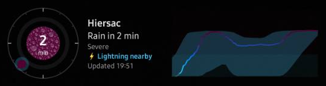
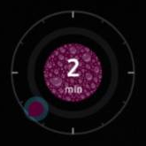
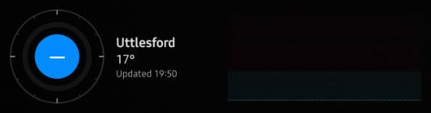
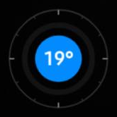

# Rain Alarm

**Know when rain will reach you—at home or on the move.**

Rain Alarm is an open-source Android app with independently configured home-screen widgets, an
animated multi-provider Radar and a foreground Travel mode. It has no accounts, advertising or
analytics.

[Download the latest release](https://github.com/Undert0e-505/RainAlarm/releases/latest) ·
[What’s new in v0.9.0](docs/releases/v0.9.0.md) · [User guide](docs/USER_GUIDE.md)

## See Radar in motion

| Radar · Dark | Radar · Light |
| :---: | :---: |
| [](docs/screenshots/radar-dark-baltinglass.gif) | [](docs/screenshots/radar-light-baltinglass.gif) |

## Travel keeps Radar current

One tap enters Travel, follows the foreground device position and puts Radar into **AUTO** time.
The timeline stays aligned with the device clock while the map shows the provider prediction or
estimate valid for now and checks enabled sources near their publication times. Scrubbing or
pressing Play hands timeline control back to the user without silently changing saved places.
Location delivery and visual smoothness remain dependent on Android, the phone and its GNSS
hardware.

## Lightning activity at a glance

An optional alert monitors EUMETSAT observed accumulated flash areas within 15 km. Lightning can
appear in widgets, combine with a newly eligible rain alert, and open the exact monitored place in
Radar with Lightning temporarily visible. It is observed satellite activity—not a strike forecast
or safety warning. See [Lightning alert behavior](docs/LIGHTNING_ALERT_REQUIREMENTS.md) and
[data-source constraints](docs/DATA_SOURCES.md#optional-eumetsat-satellite-layers).

## What else is included

- **Answer-first Now:** rain arrival, direction and intensity in a compact compass and next-hour
  chart, with optional model weather details.
- **Multi-provider Radar:** MeteoGroup/DTN, EUMETNET OPERA and RainViewer with honest coverage,
  loading and availability states; Wind, Lightning and Clouds are independent optional layers.
- **Places and alerts:** search, map selection, saved places, a startup pin and optional rain alerts.
- **Personal appearance:** Light, Dark and Slate surfaces, automatic day/night profiles, adjustable
  coverage masks and wind arrows.
- **Installed languages:** English, Dutch, Belgian Dutch, German, French, Welsh and Irish.
- **Local-first privacy:** no accounts, ads, analytics, billing SDKs or background-location
  permission.

## Get started

1. Download the signed APK from the [latest release](https://github.com/Undert0e-505/RainAlarm/releases/latest)
   and open it on an Android 8.0+ device.
2. Choose a language and a saved or current place. The short first-use tour is skippable and can be
   replayed from Settings.
3. Read **Now**, explore **Radar**, add a widget for any saved place, or enter **Travel** from Radar.

See the [installation and first-launch guide](docs/USER_GUIDE.md#first-launch-and-installation) for
permission and upgrade details.

## More screens

| Now · Baltinglass | Places |
| :---: | :---: |
| [](docs/screenshots/now-baltinglass.jpg) | [](docs/screenshots/places-baltinglass.jpg) |
| Settings · providers and indicators | Settings · playback and appearance |
| [](docs/screenshots/settings-providers.jpg) | [](docs/screenshots/settings-appearance.jpg) |

## Widgets for the places that matter

Each widget monitors one saved place independently of the place open in the app. A compact widget
can show rain arrival, current rain, direction, intensity, nearby lightning or temperature when
dry. Wider layouts add stop/window detail when known and a next-hour graph. Widgets refresh without
opening Rain Alarm, subject to Android's inexact background scheduling and device battery policy.

| Rain and lightning | Compact rain |
| :---: | :---: |
| [](docs/screenshots/widget-rain-lightning-full.png) | [](docs/screenshots/widget-rain-compact.png) |
| Arrival, severity, nearby lightning, direction and the next-hour shape in one row. | Countdown, intensity colour and direction in a 1×1 glance. |
| Full dry outlook | Compact dry |
| [](docs/screenshots/widget-dry-full.png) | [](docs/screenshots/widget-dry-compact.png) |
| Saved-place temperature with the available next-hour outlook. | A temperature-only glance with no ambiguous fallback mark. |

## Documentation

- [User guide](docs/USER_GUIDE.md)
- [Data sources, coverage and constraints](docs/DATA_SOURCES.md)
- [Privacy](docs/PRIVACY.md)
- [Development and build](docs/DEVELOPMENT.md)
- [Widget behavior](docs/WIDGET_REQUIREMENTS.md)
- [Lightning alert behavior](docs/LIGHTNING_ALERT_REQUIREMENTS.md)
- [Feature tour](docs/FEATURE_TOUR.md) and [localization](docs/LOCALIZATION.md)
- [v0.9.0 release notes](docs/releases/v0.9.0.md) and [road to 1.0](docs/NEXT_PHASE.md)

## Privacy and safety

Rain Alarm requests only foreground location and optional notification permission. It talks
directly to the map, weather, radar, satellite and search providers described in the
[privacy disclosure](docs/PRIVACY.md); no provider credentials are embedded in the app.

> [!WARNING]
> Rain Alarm is an experimental information aid, not a safety-critical warning service. A dry
> result or missing alert can reflect unavailable, stale or uncertain data; do not rely on it as
> your only source for weather-safety decisions.

## Build from source

Rain Alarm 0.9.0 (version code 20) supports Android 8.0 and later. With JDK 21, Android SDK Platform
37 and Build Tools 36.0.0 installed, run on Windows:

```powershell
$env:ANDROID_HOME='D:\path\to\android-sdk'
.\gradlew.bat `
  :app:directDebugUnitTest `
  :app:lintDebug `
  :app:assembleDebug
```

The [development guide](docs/DEVELOPMENT.md) covers normal CI tests, the current Windows-host
workaround, signed local builds and maintainer-only publication.

## Contributing

Small, focused issues and pull requests are welcome. Include unit tests for decision or maths
changes and device/API checks for UI, permissions and GLES work. Rain Alarm is a clean-room project:
do not copy proprietary RainToday code, binaries, artwork or credentials, or add undocumented
endpoints; see the [clean-room boundary](docs/DEVELOPMENT.md#clean-room-boundary).

Licensed under the [MIT License](LICENSE).
