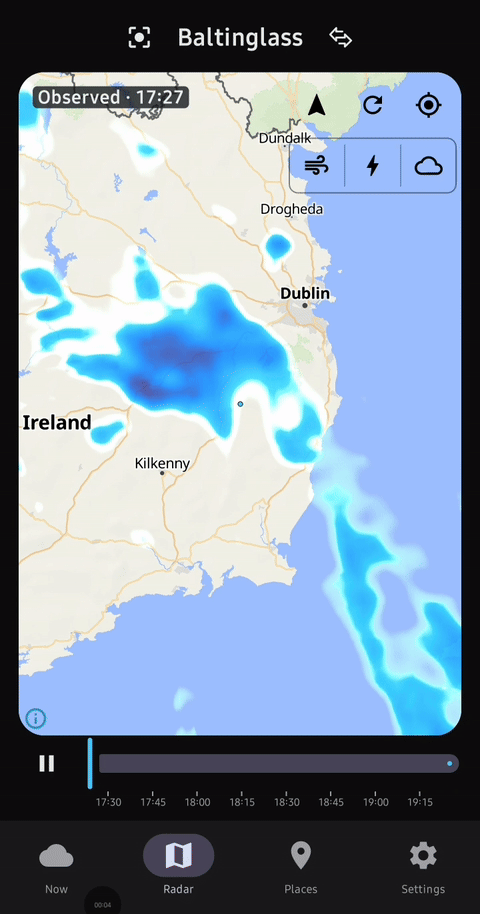
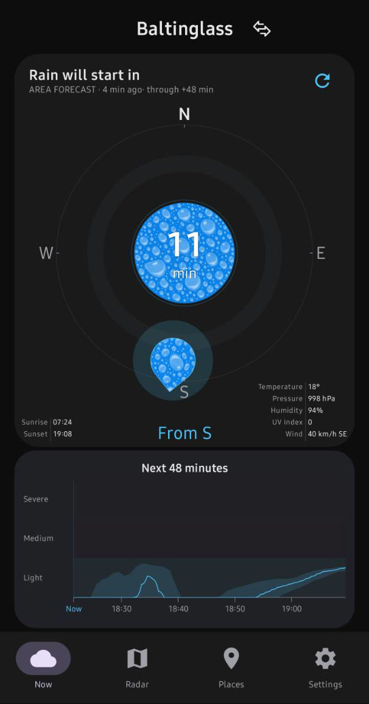
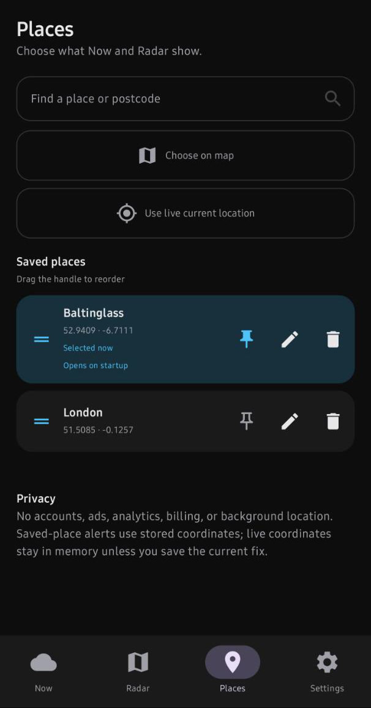
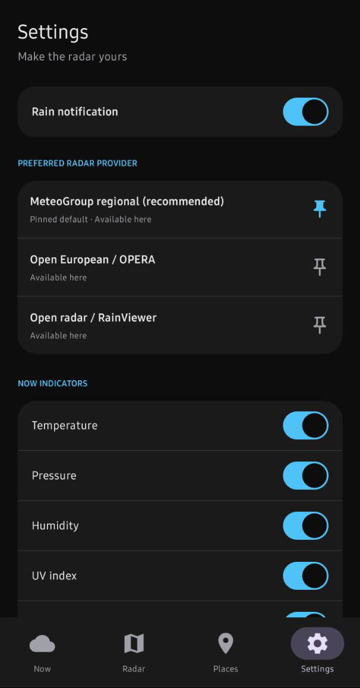
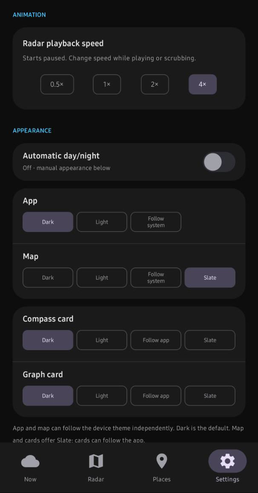

# Rain Alarm

**Know when rain will reach you.**

Rain Alarm is an open-source Android app that combines place-specific rain-arrival estimates, animated radar and a driving-friendly Travel mode. It has no accounts, advertising or analytics.

[Download the latest release](https://github.com/Undert0e-505/RainAlarm/releases/latest) · [What’s new in v0.4.1](docs/releases/v0.4.1.md) · [User guide](docs/USER_GUIDE.md)

## See it in motion

| Radar · Dark | Radar · Light |
| :---: | :---: |
| [](docs/screenshots/radar-dark-baltinglass.gif) | [](docs/screenshots/radar-light-baltinglass.gif) |

## Why Rain Alarm

- **See when rain is coming.** Now combines arrival time, direction and intensity into a compact compass and a minute-by-minute chart.
- **Watch the weather move.** Radar blends observations and available forecasts across a continuous, scrubbable timeline with 0.5×, 1×, 2× and 4× playback.
- **Take it on the road.** Travel follows precise foreground location updates, keeps the screen awake while active and checks enabled weather sources around their expected publication times.
- **Choose the best available radar.** Pin MeteoGroup, EUMETNET OPERA or RainViewer as your preference; Rain Alarm falls back when that provider does not cover the selected place.
- **Add useful context.** Independently enable Wind, EUMETSAT Lightning and day/night Clouds layers without hiding the rain timeline.
- **Use the places that matter.** Search towns, postcodes and named places, choose on a map, use live location, save favourites and optionally receive an alert before rain reaches the active place.
- **Keep your data yours.** There are no user accounts, ads, analytics, billing SDKs or background-location tracking. Places and preferences stay on the device.
- **Make it comfortable.** Mix Light, Dark and Slate surfaces, create automatic day/night profiles, resize wind arrows and use English, Dutch, Belgian Dutch, German, French, Welsh or Irish.

## Read the forecast with confidence

Now uses plain arrival and motion language, but it does not hide uncertainty. Its chart ends at the source's real prediction horizon, missing direction is never invented, and stale weather facts remain unavailable rather than being guessed.

Radar labels provider forecasts and Rain Alarm's confidence-gated local motion as different kinds of future information. Coverage masks darken areas where the active source cannot support the same conclusion, while temporary loading and unavailable states remain distinct from a genuinely dry outlook. Provider imagery can disagree because each service uses a different composite; Rain Alarm presents those echoes consistently without moving or reshaping them to imitate another source.

## Get started

1. **Install Rain Alarm.** Download the signed APK from the [latest release](https://github.com/Undert0e-505/RainAlarm/releases/latest), allow your browser or file manager to install that APK when Android asks, then open the app.
2. **Choose a place.** Use current location, search, choose on the map or select a saved place. A saved place can also be pinned as the one that opens on startup.
3. **Check the outlook.** Read Now for the next-hour summary, open Radar to inspect the timeline and optional layers, and enable Rain Notification in Settings if you want advance notice.

The first launch asks for language before any platform permission and offers a short, skippable tour using clearly labelled example weather. See the [full first-launch and installation guide](docs/USER_GUIDE.md#first-launch-and-installation).

## More screens

| Now · Baltinglass | Places |
| :---: | :---: |
| [](docs/screenshots/now-baltinglass.jpg) | [](docs/screenshots/places-baltinglass.jpg) |
| Settings · providers and indicators | Settings · playback and appearance |
| [](docs/screenshots/settings-providers.jpg) | [](docs/screenshots/settings-appearance.jpg) |

## Documentation

- [User guide](docs/USER_GUIDE.md) — installation, first launch, Now, Radar, Places, alerts, appearance, navigation and languages.
- [Data sources and constraints](docs/DATA_SOURCES.md) — provider behavior, coverage, processing, attribution and known limits.
- [Privacy](docs/PRIVACY.md) — permissions, network requests, location handling, local storage and notifications.
- [Development and build](docs/DEVELOPMENT.md) — prerequisites, tests, signed builds, publication and contribution expectations.
- [Feature tour](docs/FEATURE_TOUR.md) — deterministic example weather, spotlight geometry and state isolation.
- [Localization](docs/LOCALIZATION.md) — supported languages, terminology and quality gates.
- [v0.4.1 release notes](docs/releases/v0.4.1.md) and [deferred roadmap](docs/NEXT_PHASE.md).

## Privacy and safety

Rain Alarm requests only the permissions needed for foreground current location and optional notifications. Network requests go directly to the map, weather, radar, satellite and search providers described in the [privacy disclosure](docs/PRIVACY.md); the app embeds no provider credentials and does not send account, advertising, analytics or billing data.

> [!WARNING]
> Rain Alarm is an experimental information aid, not a safety-critical warning service. A dry result or missing alert can reflect unavailable, stale or uncertain data; do not rely on it as your only source for weather-safety decisions.

## Build from source

Rain Alarm 0.4.1 (version code 19) supports Android 8.0 and later. With JDK 21, Android SDK Platform 37 and Build Tools 36.0.0 installed, run on Windows:

```powershell
$env:ANDROID_HOME='D:\path\to\android-sdk'
.\gradlew.bat `
  :app:directDebugUnitTest `
  :app:lintDebug `
  :app:assembleDebug
```

The [development guide](docs/DEVELOPMENT.md) covers the standard test task, this host’s test-worker workaround, signed local builds and the maintainer-only release workflow.

## Contributing

Small, focused issues and pull requests are welcome. Include unit tests for decision or maths changes and describe device/API-level checks for UI, permissions and GLES work. Rain Alarm is a clean-room project: contributions must not copy proprietary RainToday code, native binaries, artwork or credentials, or add undocumented endpoints; see the [development guide](docs/DEVELOPMENT.md#clean-room-boundary).

Licensed under the [MIT License](LICENSE).
